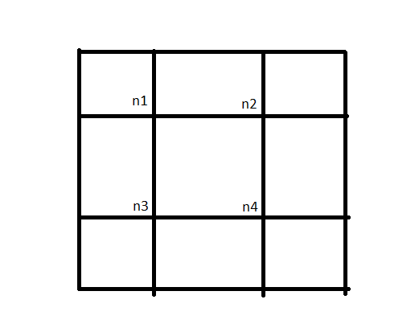
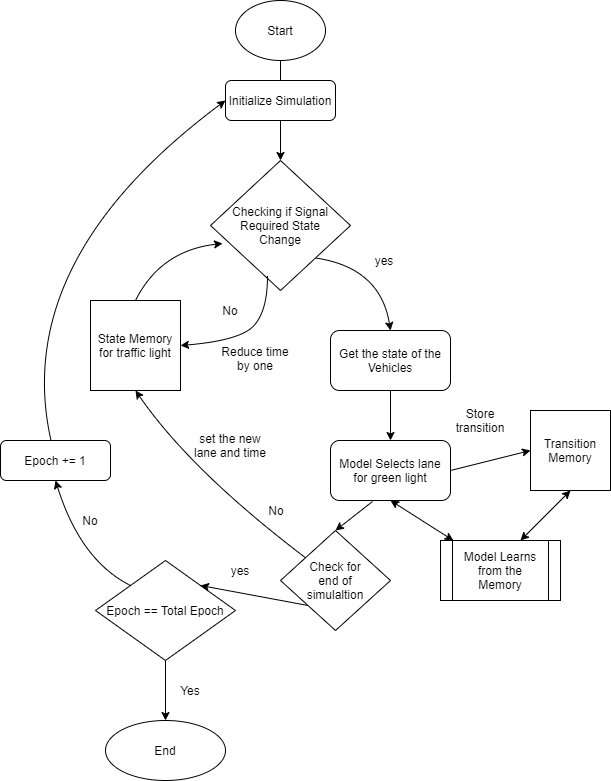
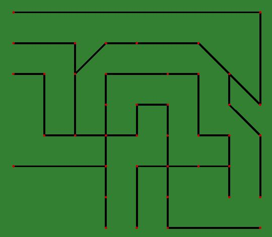
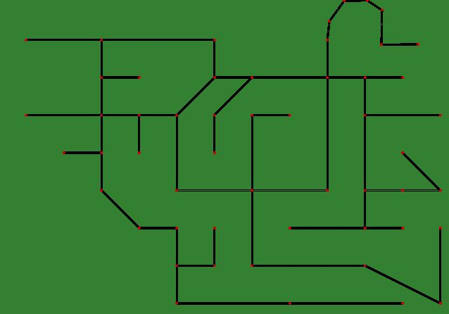
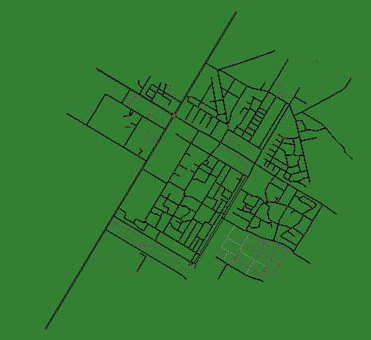
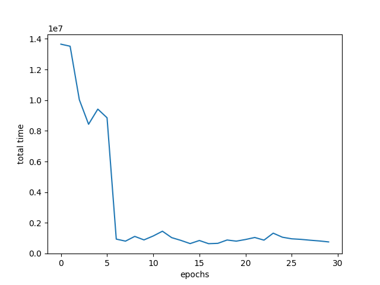
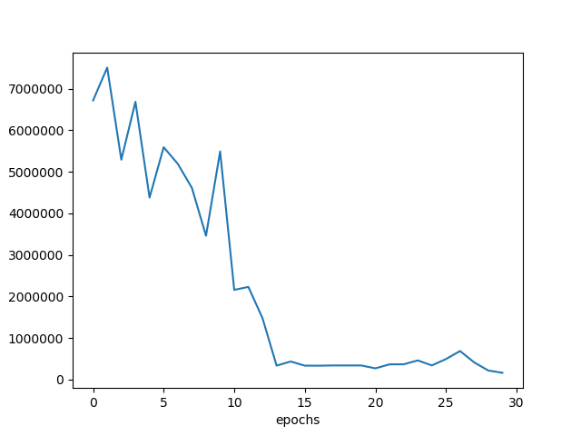
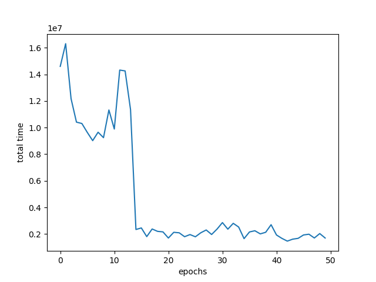

# Intelligent Traffic Control System using Reinforcement Learning

<p align = "center">
    
</p>


This project presents an advanced traffic management system that leverages **Reinforcement Learning (RL)** to dynamically optimize traffic signal timings. By creating a smart, adaptive agent, this system can significantly reduce vehicle congestion and average wait times compared to traditional fixed-time traffic controllers. The entire environment is simulated using **SUMO (Simulation of Urban MObility)**.

---

## The Core Idea

The goal is to move beyond rigid, pre-programmed traffic lights and create a system that can **perceive** its environment and make **intelligent decisions** in real-time.



Our RL agent observes the state of the traffic network at each intersection—specifically, the number of cars waiting in each direction. Based on this input, it learns an optimal policy to decide which lane gets the green light next. The primary objective is to minimize the cumulative wait time for all vehicles in the simulation.

### How it Learns
The agent is trained through thousands of simulated traffic scenarios. It learns by trial and error, associating its actions (changing the lights) with outcomes (changes in traffic flow). Positive outcomes (reduced congestion) are rewarded, reinforcing the agent's decision-making process.



---

## Technology Stack

* **Simulation:** [SUMO (Simulation of Urban MObility)](https://sumo.dlr.de/docs/index.html)
* **Machine Learning:** Python, TensorFlow, Keras
* **Core Libraries:** NumPy, Traci

---

## Simulation Environments

To ensure the agent is robust and can handle diverse traffic situations, it was trained and tested on a variety of custom-built maps with different layouts and complexities.

| Map 1: Simple Grid                                                                                | Map 2: Denser Network                                                                                   | Map 3: Urban Layout                                                                                 |
| :--------------------------------------------------------------------------------------------------: | :------------------------------------------------------------------------------------------------------: | :--------------------------------------------------------------------------------------------------: |
|  |  |  |

---

## Performance and Results

The effectiveness of the Reinforcement Learning model is demonstrated by its ability to reduce the total vehicle waiting time as it gains more experience over training epochs. The graphs below clearly show a downward trend in wait times across the different training environments.

| Training on Map 1                                                                                                        | Training on Map 2                                                                                                        | Training on Map 3                                                                                                    |
| :-----------------------------------------------------------------------------------------------------------------------: | :-----------------------------------------------------------------------------------------------------------------------: | :-------------------------------------------------------------------------------------------------------------------: |
|  |  |  |

---

## How to Use This Project

Follow these steps to set up and run the simulation on your own machine.

### Prerequisites

1.  **Install Python:** Ensure you have Python 3.8 or newer installed.
2.  **Install SUMO:** Download and install the SUMO simulation suite from the [official website](https://sumo.dlr.de/docs/Downloads.php). Make sure to set the `SUMO_HOME` environment variable.
3.  **Clone the Repository:**
    ```bash
    git clone <your-repository-url>
    cd <your-repository-name>
    ```
4.  **Install Dependencies:**
    ```bash
    pip install -r requirements.txt
    ```

---

### Running a Pre-trained Model

Each model in the `/models` folder is trained for a specific map in the `/maps` folder. To run a simulation, you must first configure the project to use the correct map.

**Step 1: Configure the Map**

Open the `configuration.sumocfg` file. This file tells SUMO which map and route files to load.

**Step 2: Edit the File Paths**

Modify the `net-file` and `route-files` values to point to the desired map. For example, to test the model trained on `city3.net.xml`, your configuration file should look like this:

```xml
<input>
    <net-file value="maps/city3.net.xml"/>
    <route-files value="maps/city3.rou.xml"/>
</input>
````

**Step 3: Run the Simulation Command**

Execute the `train.py` script from your terminal, specifying the model you want to run.

```bash
# Example for running the model trained on city3
python train.py -m model_city3 -s 500
```

This will launch the SUMO GUI, where you can see the trained agent controlling the traffic lights in real-time.

-----

### Training a New Model

You can also train a new agent on a custom map.

**Step 1: Create a New Network**

Use SUMO's **Netedit** tool to design your own road network. Save the network file in the `/maps` folder (e.g., `mynetwork.net.xml`).

**Step 2: Generate Random Traffic**

Navigate to the `/maps` directory in your terminal and use the `randomTrips.py` script to generate a route file for your new network.

```bash
cd maps
python randomTrips.py -n mynetwork.net.xml -r myroutes.rou.xml -e 1000
```

**Step 3: Configure and Train**

Update `configuration.sumocfg` to point to your new `mynetwork.net.xml` and `myroutes.rou.xml` files. Then, run the training command from the project's root directory:

```bash
# The --train flag enables training mode
python train.py --train -m my_new_model -e 50 -s 1000
```

  * `-m my_new_model`: The name for your new model.
  * `-e 50`: The number of training epochs.

The script will save your trained model in the `/models` folder and generate a performance plot in the `/plots` folder.

